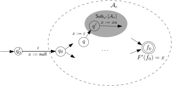
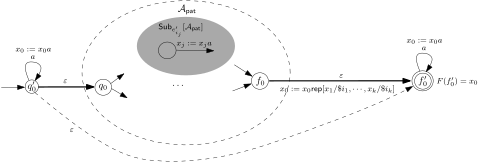

# SL to Copyless PSSTs

The following is a repeat of the CAV 2021 submission, with some minor
adjustments to satisfy the copyless property.

## Encoding Patterns as PFA

At first, we can adapt the PFA construction in [@BDM14], which in turn
is a variant of the standard Thompson construction [@Thompson68], and
show the following result.

::: {.proposition}
For each RWRE pattern $\pat$, a PFA $\patpfa{\pat}$ can be
constructed in linear time such that

* $\patpfa{\pat}$ has a unique initial state without incoming
  transitions and a unique final state without outgoing transitions, and
* for each subexpression $\pat'$ of $\pat$, $\patpfa{\pat}$
  contains an isomorphic copy of $\patpfa{\pat'}$ (i.e. the PFA
  constructed for $\pat'$), denoted by
  $\subpfa{\pat'}{\patpfa{\pat}}$.
:::

::: {.proof}
For any RWRE pattern $\pat$, a PFA $\patpfa{\pat}$ is constructed
recursively in the sequel. The constructed PFA satisfies that it has a
unique initial state and a unique final state  without outgoing
transitions.

* If $\pat = \emptyset$, then
  $\patpfa{\pat} = \tup{
    \set{\fas_0,\final}, \alphabet, \fatran, \fapriority, \fas_0, \final
  }$,
  where
    $\ap{\fatran}{\fas_0, \cha} = \ap{\fatran}{\final, \cha} = \tup{}$
        for every $\cha \in \alphabet$,
    $\ap{\fapriority}{\fas_0} = \ap{\fapriority}{\final}= (\tup{}; \tup{})$.
* If $\pat = \epsilon$, then
  $\patpfa{\pat} = \tup{
    \set{\fas_0, \final}, \alphabet, \fatran, \fapriority, \fas_0, \final
  }$,
  where
    $\ap{\fatran}{\fas_0, \cha} = \ap{\fatran}{\final, \cha} = \tup{}$
        for every $\cha \in \alphabet$,
    $\ap{\fapriority}{\fas_0} = \tup{\tup{\final}; \tup{}}$, and
    $\ap{\fapriority}{\final} = \tup{\tup{}; \tup{}}$. 
* If $\pat = \cha$, then
  $\patpfa{\pat} = \tup{
    \set{\fas_0, \final}, \alphabet, \fatran, \fapriority, \fas_0, \final
  }$,
  where
    $\ap{\fatran}{\fas_0, \cha} = \tup{\final}$,
    $\ap{\fatran}{\fas_0, b} = \tup{}$
        for every $\chb \in \alphabet \setminus \set{\cha}$,
    $\ap{\fapriority}{\fas_0} = \tup{\tup{}; \tup{}}$, and
    $\ap{\fapriority}{\final} = (\tup{}; \tup{})$.
* If $\pat = \recapture{\pat_1}$, then
  $\patpfa{\pat} = \patpfa{\pat_1}$.
* If $\pat = \brac{\pat_1 \reor \pat_2}$, let
  $\patpfa{\pat_1} = \tup{
    \fastates_1, \alphabet, \fatran_1, \fapriority_1, \fas_1, \final_1
  }$
  and
  $\patpfa{\pat_2} = \tup{
    \fastates_2, \alphabet, \fatran_2, \fapriority_2, \fas_2, \final_2
  }$,
  then
  $\patpfa{\pat} = \tup{
    \fastates_1 \cup \fastates_2 \cup \set{\fas_0, \final},
    \alphabet, \fatran, \fapriority, \fas_0, \final
  }$, where
    * $\fas_0, \final \not \in \fastates_1 \cup \fastates_2$,
    * $\ap{\fatran}{\fas, \cha} = \ap{\fatran_\idxi}{\fas, \cha}$
      for every
        $\idxi \in \set{1,2}$,
        $\fas \in \fastates_\idxi$ and
        $\cha \in \alphabet$,
    * $\ap{\fatran}{\fas_0, \cha} = \ap{\fatran}{\final, \cha} = \tup{}$
      for every $\cha \in \alphabet$, 
    * $\ap{\fapriority}{\fas} = \ap{\fapriority_\idxi}{\fas}$
      for every $\fas \in \fastates_\idxi$ ($\idxi = 1, 2$),
    * $\ap{\fapriority}{\fas_0} = \tup{\tup{\fas_1,\fas_2}; \tup{}}$,
    * $\ap{\fapriority}{\final_1}
        = \ap{\fapriority}{\final_2}
        = \tup{\tup{\final}; \tup{}}$,
      and
    * $\ap{\fapriority}{\final} = (\tup{}; \tup{})$.
* If $\pat = \brac{\pat_1 \concat \pat_2}$, let
  $\patpfa{\pat_1} = \tup{
    \fastates_1, \alphabet, \fatran_1, \fapriority_1, \fas_1, \final_1
  }$
  and
  $\patpfa{\pat_2} = \tup{
    \fastates_2, \alphabet, \fatran_2, \fapriority_2, \fas_2, \final_2
  }$,
  then
  $\patpfa{\pat} = \tup{
    \fastates_1 \cup \fastates_2,
    \alphabet, \fatran, \fapriority, \fas_1, \final_2
  }$,
  where
    * for every
        $\idxi \in \set{1,2}$,
        $\fas \in \fastates_\idxi$ and
        $\cha \in \alphabet$,
      $\ap{\fatran}{\fas, \cha} = \ap{\fatran_\idxi}{\fas, \cha}$,
    * for every
        $\fas \in \fastates_2$,
      $\ap{\fapriority}{\fas} = \fapriority_2\tup{\fas}$,
    * for every
        $\fas \in \fastates_1 \setminus \set{\final_1}$,
      $\ap{\fapriority}{\fas} = \fapriority_1(\fas)$, and
      $\ap{\fapriority}{\final_1} = (\tup{\fas_2}; \tup{})$.
* If $\pat = \restar{\pat_1}$, let
  $\patpfa{\pat_1} = \tup{
    \fastates_1, \alphabet, \fatran_1, \fapriority_1, \fas_1, \final_1
  }$,
  then
  $\patpfa{\pat} = \tup{
    \fastates_1 \cup \set{\fas_0, \final},
    \alphabet, \fatran, \fapriority, \fas_0, \final
  }$,
  where 
    * $\fas_0, \final \not \in \fastates_1$,
    * for every
        $\fas \in \fastates_1$ and $\cha \in \alphabet$,
      $\ap{\fatran}{\fas, \cha} = \ap{\fatran_1}{\fas, \cha}$,
    * for every
        $\fas \in \fastates_1 \setminus \set{\fas_1, \final_1}$,
      $\ap{\fapriority}{\fas} = \ap{\fapriority_1}{\fas}$,
      moreover,
        $\ap{\fapriority}{\fas_0} = (\tup{\fas_1}; \tup{})$,
        $\ap{\fapriority}{\fas_1} = \tup{
            \tup{\ap{\pi_1}{\ap{\fapriority_1}{\fas_1}}};
            \tup{\ap{\pi_2}{\ap{\fapriority_1}{\fas_1}}, \final}
        }$,
        $\ap{\fapriority}{\final_1} = \tup{\tup{\fas_1}; \tup{}}$, and
        $\ap{\fapriority}{\final} = \tup{\tup{}; \tup{}}$.
      (Intuitively, the $\epsilon$-transitions from $\fas_0$ to
      $\fas_1$, from $\final_1$ to $\fas_1$, and from $\fas_1$ to $\final$
      respectively are added, moreover, the $\epsilon$-transition
      from $\fas_1$ to $\final$ is of the lowest priority.)
* If $\pat = \replus{\pat_1}$, let
  $\patpfa{\pat_1} = \tup{
    \fastates_1, \alphabet, \fatran_1, \fapriority_1, \fas_1, \final_1
  }$,
  then
  $\patpfa{\pat} = \tup{
    \fastates_1 \cup \set{\fas_0, \final},
    \alphabet, \fatran, \fapriority, \fas_0, \final
  }$,
  where 
    * $\fas_0, \final \not \in \fastates_1$,
    * for every
        $\fas \in \fastates_1$ and $\cha \in \alphabet$,
      $\ap{\fatran}{\fas, \cha} = \ap{\fatran_1}{\fas, \cha}$,
    * for every
        $\fas \in \fastates_1 \setminus \set{\final_1}$,
      $\ap{\fapriority}{\fas} = \ap{\fapriority_1}{\fas}$,
      moreover,
        $\ap{\fapriority}{\fas_0} = \tup{\tup{\fas_1}; \tup{}}$,
        $\ap{\fapriority}{\final_1} = \tup{\tup{\fas_1,\final}; \tup{}}$, and
        $\ap{\fapriority}{\final} = \tup{\tup{}; \tup{}}$.
      (Intuitively, the $\epsilon$-transitions from $\fas_0$ to
      $\fas_1$, from $\final_1$ to $\fas_1$, and from $\final_1$ to $\final$
      respectively are added, moreover, the $\epsilon$-transition from
      $\final_1$ to $\final$ is of the lowest priority.)
* If $\pat = \restarng{\pat_1}$, let
  $\patpfa{\pat_1} = \tup{
    \fastates_1, \alphabet, \fatran_1, \fapriority_1, \fas_1, \final_1
  }$,
  then
  $\patpfa{\pat} = \tup{
    \fastates_1 \cup \set{\fas_0, \final},
    \alphabet, \fatran, \fapriority, \fas_0, \final
  }$,
  where 
    * $\fas_0, \final \not \in \fastates_1$,
    * for every
        $\fas \in \fastates_1$ and $\cha \in \alphabet$,
      $\ap{\fatran}{\fas, \cha} = \fatran_1(\fas, \cha)$,
    * for every
        $\fas \in \fastates_1 \setminus \set{\fas_1, \final_1}$,
    $\ap{\fapriority}{\fas} = \fapriority_1(\fas)$,
    moreover,
        $\ap{\fapriority}{\fas_0} = \tup{\tup{\fas_1}; \tup{}}$,
        $\ap{\fapriority}{\fas_1} = \tup{
            \tup{\final, \ap{\pi_1}{\ap{\fapriority_1}{\fas_1}}};
            \ap{\pi_2}{\ap{\fapriority_1}{\fas_1}}
        }$,
        $\ap{\fapriority}{\final_1} = \tup{\tup{\fas_1}; \tup{}}$, and
        $\ap{\fapriority}{\final} = \tup{\tup{}; \tup{}}$.
    (The $\epsilon$-transition from $\fas_1$ to $\final$ is of the
    highest priority.)
* If $\pat = \replusng{\pat_1}$, let
  $\patpfa{\pat_1} = \tup{
    \fastates_1, \alphabet, \fatran_1, \fapriority_1, \fas_1, \final_1
  }$,
  then
  $\patpfa{\pat} = \tup{
    \fastates_1 \cup \set{\fas_0, \final},
    \alphabet, \fatran, \fapriority, \fas_0, \final
  }$,
  where
    * $\fas_0, \final \not \in \fastates_1$,
    * for every
        $\fas \in \fastates_1$ and $\cha \in \alphabet$,
      $\ap{\fatran}{\fas, \cha} = \fatran_1(\fas, \cha)$,
    * for every
        $\fas \in \fastates_1 \setminus \set{\final_1}$,
        $\ap{\fapriority}{\fas} = \ap{\fapriority_1}{\fas}$,
      moreover,
        $\ap{\fapriority}{\fas_0} = \tup{\tup{\fas_1}; \tup{}}$,
        $\ap{\fapriority}{\final_1} = \tup{\tup{\final, \fas_1}; \tup{}}$, and
        $\ap{\fapriority}{\final} = \tup{\tup{}; \tup{}}$.
      (The $\epsilon$-transition from $\final_1$ to $\final$ is of the
      highest priority.)

:::

## Encoding String Functions

We prove Lemma \@ref(lem:string-funs-to-copyless). That is for each
string function
    $\sfun = \extract{\idxi}{\pat}$,
    $\replace{\pat}{\rep}$, or
    $\replaceall{\pat}{\rep}$,
a PSST $\sfunpsst{\sfun}$ can be constructed such that for all $\word$,
we have $\ap{\sfunpsst{\sfun}}{\word} = \ap{\sfun}{\word}$.

::: {.proof}
Let $\pat'$ be the subexpression corresponding to the
$\idxi$-th capturing group of $\pat$. In particular, if $\idxi = 0$,
then $\pat' = \pat$.  Suppose $\patpfa{\pat} = \tup{
    \fastates, \alphabet, \fatran, \fapriority, \fas_0, \final
}$.
Intuitively, $\sfunpsst{\extract{\idxi}{\pat}}$ (see
Figure \@ref(fig:psst-extract))

* (TODO: update) uses a string variable $\tvar$ to store the value of the $\idxi$th
  capturing group,
* initially assigns $\vnull$ to $\tvar$ to denote the fact that the
  capturing group is not matched yet,
* then simulates $\patpfa{\pat}$ and stores letters into $\tvar$ when
  applying the transitions in $subpfa{\pat'}{\patpfa{\pat}}$,
* finally outputs the value of $\tvar$ when $\patpfa{\pat}$ accepts.

(ref:psst-extract-cap) The PSST $\sfunpsst{\extract{\idxi}{\pat}}$

```{r, label="psst-extract", echo=FALSE, fig.cap="(ref:psst-extract-cap)"}

```

Formally,
$\sfunpsst{\extract{\idxi}{\pat}} = \tup{
    \fastates \cup \set{\ts'_0},
    \alphabet, \tvars, \ttrans', \tpriority', \tassign', \ts'_0, \tfinals'
}$, where

* $\ts'_0 \notin \fastates$,
* $\tvars = \set{\tvar}$,
* $\ttran'$ is obtained from $\ttran$ by adding
  $\tvar = \tvar a$ for each transition $\tup{\fas, \cha, \fas'}$
  in $\subpfa{\pat'}{\patpfa{\pat}}$,
* $\ap{\tfinals'}{\final} = \tvar$ and $\ap{\tfinals'}{p}$ is
  undefined for all the other states in $\fastates  \cup \set{\ts'_0}$,
* $\ttrans'$ and $\tpriority'$ are defined as follows,
    * $\ap{\tpriority'}{\ts'_0} = \tup{\tup{\fas_0}; \tup{}}$,
    * $\ttrans'$ includes all the transitions in $\fatran$,
    * $\tpriority'$ includes all the transitions in $\fapriority$,
* $\tassign'$ is copyless and defined as follows,
    * if $\fas_0$ does not occur in $\subpfa{\pat'}{\patpfa{\pat}}$,
      then
        $\ap{\ap{\tassign'}{\ts'_0, \epsilon, \fas_0}}{\tvar} = \vnull$,
      otherwise,
        $\ap{\ap{\tassign'}{\fas'_0, \epsilon, \fas_0}}{\tvar} = \epsilon$,
    * for each transition
        $\tup{\fas, \cha, \fas'}$
      in
        $\subpfa{\pat'}{\patpfa{\pat}}$,
      $\ap{\ap{\tassign'}{\fas, \cha, \fas'}}{\tvar} = \tvar \cha$,
    * for each transition
        $\tup{\ts, \cha, \ts'}$
      such that
        $\tup{\ts, \cha, \ts'}$
      does not occur in
        $\subpfa{\pat'}{\patpfa{\pat}}$
      and $\ts'$ occurs in
        $\subpfa{\pat'}{\patpfa{\pat}}$,
      $\ap{\ap{\tassign'}{\fas, \cha, \fas'}}{\tvar} = \epsilon$,
    * for all the other transitions $\fatran$ of $\patpfa{\pat}$,
      $\ap{\ap{\tassign'}{\ttran}}{\tvar} = \tvar$.

Next, we show how to construct the PSST for $\replaceall{\pat}{\rep}$.

(TODO: enumerate better)
Let
    $\reref{\idxi_1}, \cdots, \reref{\idxi_\idxk}$
with
    $\idxi_1 < \cdots < \idxi_\idxk$
be an enumeration of all the references in $\rep$.  Moreover, for every
$1 \leq \idxj \leq \idxk$, let $\pat'_{\idxi_\idxj}$ be the subexpression
of $\pat$ corresponding to the $\idxi_\idxj$-th capturing group.

Suppose $\patpfa{\pat} = \tup{
    \fastates, \alphabet, \fatran, \fapriority, \fas_0, \final
}$. Then $\sfunpsst{\replaceall{\pat}{\rep}}$ is obtained from
$\patpfa{\pat}$ by adding a fresh state $\ts'_0$ such that (see
Figure \@ref(fig:psst-replaceall))

* $\sfunpsst{\replaceall{\pat}{\rep}}$ goes from $\ts'_0$ to $\fas_0$
  via an $\epsilon$-transition of higher priority than the
  non-$\epsilon$-transitions, in order to search the first match of
  $\pat$ starting from the current position, 
* when $\sfunpsst{\replaceall{\pat}{\rep}}$ stays at $\ts'_0$, it keeps
  appending the current letter to the end of $\tvar_0$, which stores the
  output of $\sfunpsst{\replaceall{\pat}{\rep}}$,
* starting from $\fas_0$, $\sfunpsst{\replaceall{\pat}{\rep}}$ simulates
  $\patpfa{\pat}$ and stores the matches of the $\idxi_1$-th, $\ldots$,
  $\idxi_\idxk$-th capturing groups of $\pat$ into the string variables
  $\tvar_1, \cdots, \tvar_\idxk$ respectively,
* when the first match of $\pat$ is found,
  $\sfunpsst{\replaceall{\pat}{\rep}}$ goes from $\final$ to $\ts'_0$
  via an $\epsilon$-transition, appends the replacement string, which is
  $\rep[\tvar_1/\reref{\idxi_1}, \cdots, \tvar_\idxk/\reref{\idxi_\idxk}]$,
  (TODO: this is not copyless, but can easily be so)
  to the end of $\tvar_0$, resets the values of
  $\tvar_1,\cdots,\tvar_\idxk$ to $\epsilon$ and keeps searching for the
  next match of $\pat$.

(ref:psst-repall-cap) The PSST $\sfunpsst{\replaceall{\pat}{\rep}}$}

```{r, label="psst-replaceall", echo=FALSE, fig.cap="(ref:psst-repall-cap)"}
knitr::include_graphics("psst-replaceall.svg")
```

Formally,
$\sfunpsst{\replaceall{\pat}{\rep}} = \tup{
    \fastates \cup \set{\ts'_0},
    \alphabet, \tvars, \ttran', \tpriority', \tassign, \ts'_0, \tfinals
}$ where

* $\ts'_0 \notin \fastates$,
* $\tvars = \set{\tvar_0, \tvar_1, \cdots, \tvar_\idxk}$,
* $\ap{\tfinals}{\ts'_0} = \tvar_0$, and $\ap{\tfinals}{\fas'}$ is
  undefined for every $\fas' \in Q$,
* $\ttran'$ and $\tpriority'$ are obtained from $\fatran$ and
  $\fapriority$ as follows,
    * for every
        $\fas \in \fastates \setminus \set{\final}$
      and
        $\cha \in \alphabet$,
      $\ap{\fatran'}{\fas, \cha} = \ap{\fatran}{\fas, \cha}$ and
      $\ap{\fapriority'}{\fas} = \ap{\fapriority}{\fas}$, 
    * $\ap{\fatran'}{\final, \cha} = \tup{}$
      for every $\cha \in \alphabet$
      and $\ap{\fapriority'}{\final} = \tup{\tup{\fas'_0}; \tup{}}$,
* $\tassign$ is copyless and defined as follows, (TODO: make copyless)
    * for every transition
        $\tup{\fas, \cha, \fas'}$
      with $\cha \in \alphabet^\epsilon$ in $\patpfa{\pat}$,
      $\ap{\ap{\tassign}{\fas, \cha, \fas'}}{\tvar_0} = \tvar_0$,
    * for every transition
        $\tup{\fas, \cha, \fas'}$
      with
        $\cha \in \alphabet^\epsilon$
      and every
        $1 \leq \idxj \leq \idxk$,
      if
        $\tup{\fas, \cha, \fas'}$
            occurs in $\subpfa{\pat'_{\idxi_\idxj}}{\patpfa{\pat}}$,
      then
        $\ap{\ap{\tassign}{\fas, \cha, \fas'}}{\tvar_\idxj} = \tvar_ja$,
      otherwise,
        $\ap{\ap{\tassign}{\fas, \cha, \fas'}}{\tvar_\idxj} = \tvar_\idxj$,
    * for all the other transitions
        $\tup{\fas, \cha, \fas'}$
      with $\cha \in \alphabet^\epsilon$ in $\patpfa{\pat}$,
      we have $\ap{\ap{\tassign}{\fas, \cha, \fas'}}{\tvar} = \tvar$,
    * for every
        $\cha \in \alphabet$ and $1 \leq \idxj \leq \idxk$,
      $\ap{\ap{\tassign}{\ts'_0, \cha, \ts'_0}}{\tvar_0} = \tvar_0\cha$ and
      $\ap{\ap{\tassign}{\ts'_0, \cha, \ts'_0}}{\tvar_\idxj} = \tvar_\idxj$,
    * $\ap{\ap{\tassign}{\fas'_0, \epsilon, \fas_0}}{\tvar_\idxj} = \tvar_\idxj$
      for every $0 \leq \idxj \leq \idxk$,
    * $\ap{\ap{\tassign}{\final, \epsilon, \fas'_0}}{\tvar_0}
        = \tvar_0 \rep[
            \tvar_1/\reref{\idxi_1},
            \ldots,
            \tvar_\idxk/\reref{\idxi_\idxk}
        ]$,
      moreover, for every
        $1 \leq \idxj \leq \idxk$,
      $\ap{\ap{\tassign}{\final, \epsilon, \fas'_0}}{\tvar_\idxj} = \epsilon$,
      where
        $\rep[\tvar_1/\reref{\idxi_1}, \ldots, \tvar_\idxk/\reref{\idxi_\idxk}]$
      denotes the string term obtained from $\rep$ by replacing every
      occurrence of
        $\reref{\idxi_1}, \cdots, \reref{\idxi_\idxk}$
      with $\tvar_1, \cdots, \tvar_\idxk$ respectively.

:::

The construction of the PSST for $\replace{\pat}{\rep}$ is similar and
illustrated in Figure \@ref(fig:psst-replace). The details are omitted.

(ref:psst-rep-cap) The PSST $\sfunpsst{\replace{\idxi}{\pat}}$

```{r, label="psst-replace", echo=FALSE, fig.cap="(ref:psst-rep-cap)"}

```


